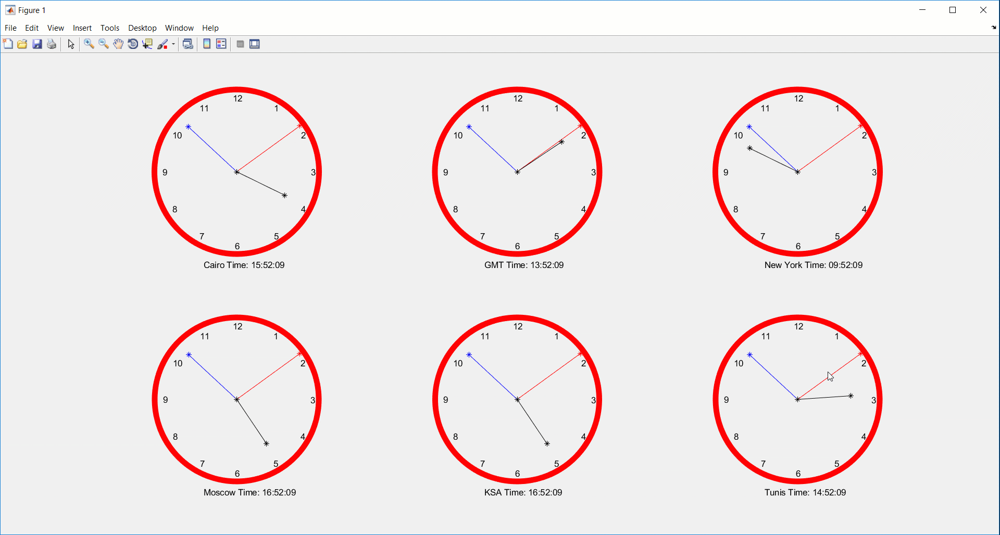
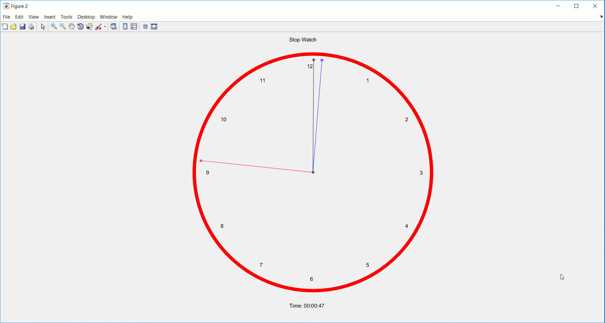

## Matlab Time Zone Clocks:
using Matlab subplots to display 6 time zone clocks of 6 capitals.

   
   
Also The project folder includes a stopWatch script

## Included Functions/ Scripts
    drawbackground
    adaptScale
    Start
    StopWatch
    updateClock

## drawbackground Function
    Used to display the clock frame and the numbers of hours.

## adaptScale Function
    Takes the current hour, min and second and rescales them to fit the drawing array points.    
    
## Start Script
    Keeps updating the clocks of all time zones and redraws the new time clock and digital value by calling the updateClock function.
    
## StopWatch Function
    Counts the time starting from 00:00:00 up to 23:59:59
    
## updateClock Functions
    takes the Hour, min and Second and updates their value. on the corresponding subplot.
 

 I'd be Glad to answer  your questions.
